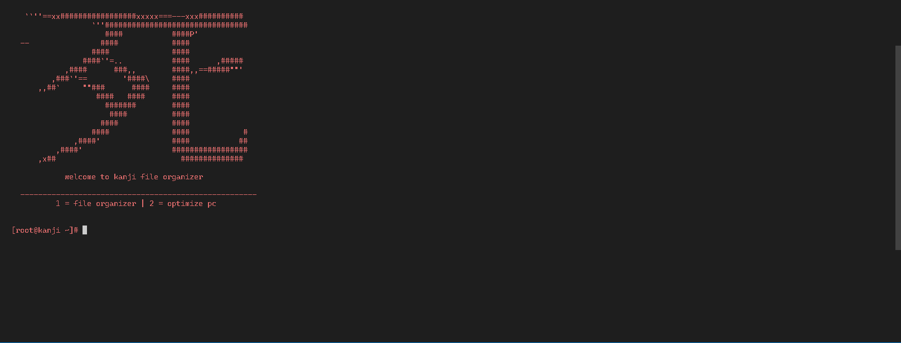

# Kanji (Open-Source)
### A very simple PC system made in python used for cleaning a bit of extra space and organization

# Updates
I updated the redirects def because it was too long and my friend [Dancers](https://github.com/alluding) suggested i define it more simple and shorter, make sure to check out his repo's.

# Features
- Optimize (Cleans Logs, Cleans Temp).
- Orginize (Puts messy files into the corresponding folder).

# Ideas
`Kanji` name made because idrk it sounded clean so I did it and `fun fact` the kanji character in the logo is for (Death).

I get that `Kanji` is messy and the main.py is overpacked for such a simple system and I dont care im too lazy to make it not overpacked.

my discord: scatpacl (1205306615570374689)
--

